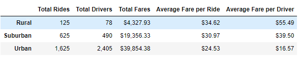
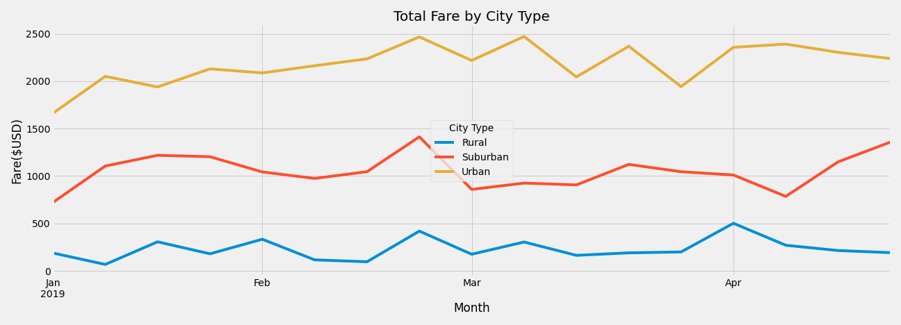

# PyBer Analysis

### PyBer Summary DataFrame

Create a summary DataFrame that showcases the correlation between average fare and total rides and drivers in each city type

- Total Rides : calculate the total rides in each city type (count of ride_id)
- Total Drivers: calcualte the total drivers in each city type (sum of driver_count from city data collection)
- Total Fares: calculate the total fare amount in each city type (sum of fare)
- Average Fare per Ride: total fare / total rides
- Average Fare per Driver: total fare / total drivers

Limitation:

The dataset did not mention how fare of each ride-sharing is calculated (distance, time, or one way or round-trip).

Conclusion:

Total number of rides in rural cities is 5 to 13 times less than suburban and urban cities respectively so the total fare amount of rural and total drivers are also less than suburban and urban cities. Because of not many drivers in rural cities, its average fare per ride  and the average fare per driver are higher than suburban and urban cities. By looking at the average fare per driver, drivers in rural cities makes more 3 times than driver urban cities. However, urban rides are more frequencely booked than rural rides. The average fare per ride in suburban and urban cities are cheaper than rural cities because suburban and urban total drivers are more 6 to 30 times than rural total drivers.

### PyBer Multiple-Line Plot 

The Sum of the Fares for Each City Type

- Create a data frame plot the total fare of each city type between January to Arpil 2019
- Pivot the dataframe with city type (column) and sum fares (value) and date (index) 
- Each data point in the chart is ***the total fare per week*** of each city type

Conclusion:

Total fare of rural cities is less 3 to 6 times than suburban and urban citites during periods. The total fare of rural cities did not over $500 per week at any period. On other hand, the total fare of urban citites is consistence about $2000 per week, and the total fare of suburban cities is relative around $1200 per week. Between Feburary and March, the total fare of three city types are peeked. This is very interesting situtation because the demand of rides is higher than normal. Overall, poeple in urban and suburban cities are using ride-sharing more than poeple in rural cities. 
